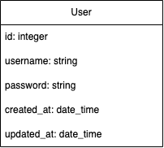

# ai-fapi-svc

The ai-fapi-svc serves as a FastAPI project. :goat: :goat: :goat:

## Getting Started

### Prerequisites

- Python version: `python 3.12.0`
- FastAPI version: `fastapi 0.108.0`
- uvicorn: `uvicorn 0.25.0`
- Database: `postgresql`

## Installation

- Clone the repository: `git clone git@gitlab.com:ekilasolutions/ekai/ai-fapi-svc.git`
- Install virtual environment: `python3 -m venv env`
- Activate virtual environment: `source ./env/bin/activate`
- Go to ai-fapi-svc folder: `cd ./ai-fapi-svc`
- Install the dependencies: `pip install -r requirements.txt`
- Create .env file from .env.example
- Create database in PosgresSQL database: `fast_api_template` and `fast_api_template_test`
- Run migration: `alembic upgrade head`
- Run application: `uvicorn main:app --reload`
- Visit `http://127.0.0.1:8000` and start your development
- Account
```
username: superadmin
password: 1234

username: admin
password: 1234
```
## API documentation

- Visit `http://127.0.0.1:8000/docs` or `http://127.0.0.1:8000/redoc` to watch API documentation

## Testing

- Run test by `pytest`

## Database diagram


